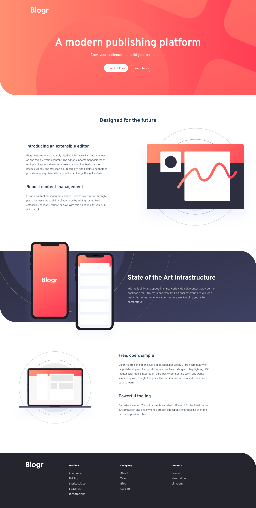

# Blogr landing page solution

This is a solution to the [Blogr landing page challenge on Frontend Mentor](https://www.frontendmentor.io/challenges/blogr-landing-page-EX2RLAApP). 

## Table of contents

- [Overview](#overview)
  - [The challenge](#the-challenge)
  - [Screenshot](#screenshot)
  - [Links](#links)
- [My process](#my-process)
  - [Built with](#built-with)
  - [Useful resources](#useful-resources)
- [Author](#author)

## Overview

### The challenge

Users should be able to:

- View the optimal layout for the site depending on their device's screen size
- See hover states for all interactive elements on the page

### Screenshot

### Links

- Solution URL: [Link](https://github.com/zofiadob/blogr-landing-page)
- Live Site URL: [Link](https://zofiadob.github.io/blogr-landing-page/)

## My process

### Built with

- Semantic HTML5 markup
- CSS custom properties
- JS functions
- SASS
- Mobile-first workflow

### Useful resources

- [SASS tutorial](https://www.youtube.com/watch?v=_a5j7KoflTs)
- [SASS documentation](https://sass-lang.com/) 

## Author

- Frontend Mentor - [@zofiadob](https://www.frontendmentor.io/profile/zofiadob)

